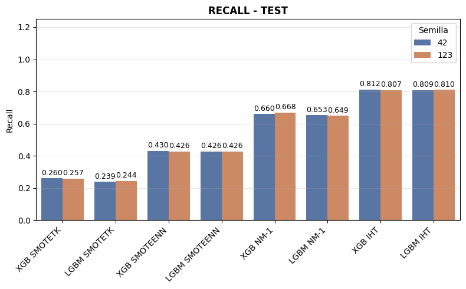

# Sistema de Predicción de Inasistencias (No-Shows) en Consultas Externas

## Hospital de Apoyo María Auxiliadora — Lima, Perú

---

## Resumen Ejecutivo

Las inasistencias de pacientes a citas médicas programadas (conocidas como *no-shows*) constituyen un problema crítico de gestión hospitalaria a nivel mundial. Según la literatura, las tasas de inasistencia oscilan entre el 13% y el 43% dependiendo de la región y el tipo de servicio de salud (Yang et al., 2024). En el contexto del Perú, el Hospital de Apoyo María Auxiliadora enfrenta tasas de inasistencia que impactan directamente en la eficiencia operativa, la pérdida de recursos económicos y la restricción del acceso oportuno a servicios de salud para otros pacientes.

Este proyecto implementa un **sistema de Machine Learning supervisado** para predecir si un paciente asistirá o no a su cita médica, utilizando datos administrativos y demográficos del hospital. El enfoque se centra en **maximizar la sensibilidad (Recall)** de la clase de inasistencia, priorizando la detección de pacientes con alta probabilidad de faltar para poder intervenir oportunamente.

El pipeline experimental combina modelos de **Gradient Boosting** (XGBoost y LightGBM) con técnicas avanzadas de balanceo de clases y optimización de hiperparámetros, siguiendo rigurosamente la metodología **CRISP-DM** (*Cross-Industry Standard Process for Data Mining*).

**Resultado principal:** La combinación **IHT + XGBoost** logra un **Recall del 80.97%** en la detección de inasistencias, lo que significa que el sistema identifica correctamente al 81% de los pacientes que efectivamente faltarán a su cita.

---

## Fuentes de Datos

- **Portal de Datos Abiertos del Gobierno del Perú:** [Citas Médicas — Hospital de Apoyo María Auxiliadora](https://www.datosabiertos.gob.pe/dataset/citas-medicas-en-el-hospital-de-apoyo-maria-auxiliadora-hma)
- **Registros:** 450,629 citas médicas.
- **Periodo:** 2023

---

## Metodología CRISP-DM

El proyecto sigue las 6 fases de la metodología CRISP-DM, un marco estandarizado para proyectos de minería de datos y ciencia de datos.

---

### Fase 1: Comprensión del Negocio (Business Understanding)

**Problema de negocio:** Las inasistencias a citas médicas generan:
- Pérdida de recursos humanos e infraestructura (médicos sin pacientes que atender).
- Extensión de listas de espera para pacientes que sí necesitan atención.
- Pérdidas económicas estimadas en cientos de miles de soles anuales.

**Objetivo del proyecto:** Desarrollar un modelo predictivo que permita al hospital identificar prospectivamente a los pacientes con mayor probabilidad de inasistir, habilitando intervenciones preventivas como recordatorios personalizados, sobreprogramación inteligente y reasignación dinámica de turnos.

**Métrica de negocio prioritaria:** **Recall de la Clase 1 (Inasistencia)**. En el contexto hospitalario, un **falso negativo** (predecir que el paciente asistirá cuando en realidad faltar tiene un costo elevado: el turno se pierde sin posibilidad de reasignación. Priorizar Recall(C1) significa maximizar la detección de inasistencias reales, incluso a costa de generar más falsas alarmas (falsos positivos), ya que el costo de una intervención innecesaria (ej. un SMS de recordatorio) es significativamente menor que el costo de un turno perdido.

---

### Fase 2: Comprensión de los Datos (Data Understanding)

**Exploración inicial del dataset:**

| Característica | Valor |
|----------------|-------|
| Total de registros | 450,629 citas |
| Pacientes únicos | 97,549 |
| Variables originales | 15 (incluyendo `ID`, fechas, especialidad, sexo, edad, seguro, tipo de atención, monto, ubicación geográfica) |
| Tasa de inasistencia (target `ATENDIDO`) | 31.88% (clase `NO VINO` = 1) |
| Variable objetivo | `ATENDIDO` (binaria: `SI` = 0, `NO` = 1) |

**Calidad de datos identificada:**
- 3 registros con valor nulo en `SEGURO`
- 1 registro con valor nulo en `EDAD`
- Valores negativos en `EDAD` (outliers inconsistentes, probablemente errores de captura)
- Varias especialidades presentan 100% de inasistecnias, posibles errores de registro, inconsistencias que pueden sesgar las predicciones.
- Variables geográficas del Hospital (`DEPARTAMENTO`, `PROVINCIA`, `DISTRITO`, `UBIGEO`) excluidas por ser irelevantes para el analisis.

---

### Fase 3: Preparación de los Datos (Data Preparation)

**Feature Engineering — 10 Variables Predictoras Finales:**

| Variable | Tipo | Descripción |
|----------|------|-------------|
| `especialidad` | Categórica | Especialidad médica de la cita |
| `citas_previas` | Categórica | Número acumulado de citas previas del paciente |
| `mes_cita` | Categórica | Mes de la cita médica (1–12) |
| `presencial_remoto` | Categórica | Modalidad de la consulta (presencial o remota) |
| `edad` | Numérica (float32) | Edad del paciente en años |
| `dia_mes_cita` | Categórica | Día del mes de la cita (1–31) |
| `tasa_noshow_previa` | Categórica | Proporción acumulada de inasistencias previas del paciente |
| `seguro` | Categórica | Tipo de seguro de salud (SI/NO) |
| `diferencia_dias` | Numérica (float32) | Días transcurridos entre la solicitud y la fecha de la cita |
| `noshow_previos` | Categórica | Número acumulado de inasistencias previas del paciente |

**Limpieza de datos:**
- **Filtro de especialidades:** Se excluyen especialidades con mas del 90% de clase 1 por ser datos inconsistentes, se conservan únicamente especialidades con al menos 365 citas anuales para garantizar representatividad estadística.
- **Valores nulos:** Eliminación de registros con valores faltantes en `EDAD` y `SEGURO`.
- **Consistencia temporal:** Corrección de valores negativos de `EDAD` a su valor absoluto y eliminación de registros con `diferencia_dias` negativa.

**Seleccion de variables (SHAP):** Se aplicó análisis SHAP (*SHapley Additive exPlanations*) con modelos XGBoost y LightGBM para validar la importancia de las 10 variables seleccionadas.

---

### Fase 4: Modelado (Modeling)

#### Arquitectura del Pipeline Experimental

```
Dataset (412,579 registros, 10 features)
    │
    ├── Para cada seed en [42, 123]:
    │       │
    │       ├── train_test_split (85%/15%, stratify, seed=N)
    │       │
    │       ├── TRAIN ──► StratifiedKFold (n_splits=1)
    │       │       │
    │       │       └── Fold 1: Preprocesar → Balanceo (4 técnicas) → Optuna (10 trials)
    │       │
    │       ├── Reentrenar con mejores params en TRAIN completo balanceado
    │       │
    │       └── TEST (15%) → Evaluar SIN balanceo
    │
    └── Agregar resultados de ambos seeds → mean ± std global
```

#### Componentes Clave del Pipeline

| Componente | Configuración |
|------------|---------------|
| **Modelos** | XGBoost, LightGBM (API nativa, GPU CUDA) |
| **Balanceo de clases** | SMOTETomek, SMOTEENN, NearMiss-1, Instance Hardness Threshold (IHT) |
| **Optimización de hiperparámetros** | Optuna (TPE Sampler, 10 trials por combinación) |
| **Métrica de optimización** | ROC-AUC |
| **Preprocesamiento** | MinMaxScaler (numéricas) + OrdinalEncoder (categóricas) |
| **Semillas** | [42, 123] (2 semillas para estabilidad) |
| **Total de datasets balanceados** | 8 (2 seeds × 4 técnicas de balanceo × 1 fold) |
| **Hold-out para test** | 15% estratificado por semilla |

#### Técnicas de Balanceo Evaluadas

1. **SMOTETomek (SMOTETK):** Combina oversampling sintético (SMOTE) con undersampling basado en vecinos más cercanos para limpiar la frontera de decisión.
2. **SMOTEENN (SMOTEENN):** Combina SMOTE con Edited Nearest Neighbors para eliminar instancias ruidosas de la clase mayoritaria.
3. **NearMiss-1 (NM-1):** Undersampling que elimina instancias de la clase mayoritaria con mayor distancia a la clase minoritaria.
4. **Instance Hardness Threshold (IHT):** Undersampling que elimina instancias de la clase mayoritaria con alta "dureza" de clasificación (probabilidad elevada de ser mal clasificadas), filtrando outliers y ruido (Deina et al., 2024).

---

### Fase 5: Evaluación (Evaluation)

#### Resultados en TEST (15% hold-out, 2 semillas: 42 y 123)

| Combinación | Accuracy | Precision (C1) | **Recall (C1)** | Precision (C0) | Recall (C0) | ROC AUC |
|-------------|----------|----------------|-----------------|----------------|-------------|---------|
| **IHT + XGB** | 0.4749 ± 0.0004 | 0.3041 ± 0.0007 | **0.8097 ± 0.0036** | 0.8451 ± 0.0022 | 0.3591 ± 0.0007 | 0.6366 ± 0.0023 |
| **IHT + LGBM** | 0.4747 ± 0.0031 | 0.3040 ± 0.0012 | **0.8096 ± 0.0011** | 0.8449 ± 0.0009 | 0.3589 ± 0.0045 | 0.6371 ± 0.0032 |
| NM-1 + XGB | 0.4986 ± 0.0034 | 0.2914 ± 0.0006 | 0.6641 ± 0.0060 | 0.7916 ± 0.0005 | 0.4414 ± 0.0067 | 0.5526 ± 0.0001 |
| NM-1 + LGBM | 0.5003 ± 0.0006 | 0.2898 ± 0.0008 | 0.6509 ± 0.0025 | 0.7878 ± 0.0012 | 0.4412 ± 0.0067 | 0.5508 ± 0.0017 |
| SMOTEENN + XGB | 0.7279 ± 0.0039 | 0.4679 ± 0.0079 | 0.4280 ± 0.0028 | 0.8316 ± 0.0042 | 0.4471 ± 0.0052 | 0.7013 ± 0.0019 |
| SMOTEENN + LGBM | 0.7283 ± 0.0061 | 0.4686 ± 0.0122 | 0.4262 ± 0.0003 | 0.8328 ± 0.0081 | 0.4463 ± 0.0057 | 0.7000 ± 0.0038 |
| SMOTETK + XGB | 0.7661 ± 0.0005 | 0.6053 ± 0.0039 | 0.2589 ± 0.0023 | 0.9416 ± 0.0015 | 0.3626 ± 0.0015 | 0.7130 ± 0.0013 |
| SMOTETK + LGBM | 0.7646 ± 0.0004 | 0.6057 ± 0.0039 | 0.2412 ± 0.0035 | 0.9457 ± 0.0017 | 0.3450 ± 0.0029 | 0.7037 ± 0.0033 |

> **Nota:** C1 = Clase 1 (NO VINO / inasistencia). C0 = Clase 0 (VINO / asistencia).



#### Análisis de Resultados — Recall como Métrica Principal

**Combinaciones ganadoras:**

| Modelo | Balanceo | Recall (C1) | Trade-off |
|--------|----------|-------------|-----------|
| **XGBoost** | **IHT** | **0.8097 ± 0.0036** | Baja accuracy (0.4749), muchas falsas alarmas |
| **LightGBM** | **IHT** | **0.8096 ± 0.0011** | Misma situación, menor varianza entre semillas |

Las combinaciones con **IHT** logran el mayor Recall (~0.81), detectando el **81% de las inasistencias reales**. El costo es una Accuracy baja (~0.47) y muchas falsas alarmas (Precision C1 ~0.30), lo cual es **aceptable** cuando el costo de no detectar una inasistencia supera el costo de una intervención innecesaria.

**Comparación con otras técnicas:**
- **SMOTETK+XGB** obtiene la mayor Precision(C1) (0.6053) y ROC AUC (0.7130), pero su Recall(C1) es bajo (0.2589), detectando solo el 26% de inasistencias.
- **NM-1** obtiene un Recall intermedio (~0.66) pero con una varianza mayor y un rendimiento global inferior a IHT.

**Conclusión evaluativa:** La técnica **Instance Hardness Threshold (IHT)** es superior para este problema clínico porque filtra instancias de la clase mayoritaria con alta dureza de clasificación, permitiendo al modelo centrarse en las fronteras de decisión más relevantes para detectar inasistencias (Deina et al., 2024).

---

### Fase 6: Implementación y Despliegue (Deployment)

#### Modelo Seleccionado — Ensamble para Maximizar Recall

Se propone un **ensamble orientado a maximizar el Recall de la clase 1 (inasistencias)**, combinando las predicciones de ambos modelos ganadores:

| Modelo | Balanceo | Recall (C1) | Precision (C1) | ROC AUC |
|--------|----------|-------------|----------------|---------|
| XGB | IHT | **0.8097 ± 0.0036** | 0.3041 ± 0.0007 | 0.6366 ± 0.0023 |
| LGBM | IHT | **0.8096 ± 0.0011** | 0.3040 ± 0.0012 | 0.6371 ± 0.0032 |

**Regla de decisión del ensamble:** Se promedian las probabilidades de predicción de ambos modelos (IHT+XGB e IHT+LGBM). Si la probabilidad promedio supera el umbral de 0.5, se predice inasistencia. Promediar las probabilidades suaviza las predicciones individuales y mejora la generalización.

#### Arquitectura de Despliegue

| Componente | Descripción |
|------------|-------------|
| **Servidor de Modelos** | API REST (FastAPI/Docker) con 2 modelos serializados (IHT+XGB, IHT+LGBM) |
| **Pipeline de Predicción** | Preprocesamiento → Predicción IHT+XGB + IHT+LGBM → Promedio de probabilidades → Umbral 0.5 → Alerta |
| **Base de Datos** | Historial de predicciones, resultados reales y métricas del ensamble |

**Modo de operación:**
- **Tiempo real** (al agendar cita): Predicción inmediata para alertas de riesgo.
- **Batch** (diario/semanal): Reportes de inasistencias detectadas para planificación.

#### Automatización de Intervenciones

| Nivel de riesgo | Acción |
|-----------------|--------|
| Alto (< 50% prob. asistencia) | Llamada telefónica + SMS + reasignación prioritaria |
| Medio (50–70%) | SMS + WhatsApp |

#### Monitoreo Continuo

- **Métricas:** Recall (principal), Precision, F1, AUC
- **Operacional:** Tiempo de respuesta API (<100ms), uptime (>99.5%)
- **Data drift:** Alerta si la distribución se desvía más de 2 desviaciones estándar
- **Reentrenamiento:** Completo cada 6 meses, fine-tuning cada 3 meses

#### Roadmap de Implementación (6 meses)

| Fase | Período | Actividades |
|------|---------|-------------|
| **Preparación** | Mes 1 | Serializar 2 modelos, crear API REST, documentación técnica |
| **Piloto** | Mes 2–3 | Desplegar ensamble en entorno controlado, comparar rendimiento real vs. esperado |
| **Expansión** | Mes 4–5 | Integrar con sistemas hospitalarios (HIS/EHR), automatizar intervenciones |
| **Operación** | Mes 6+ | Monitoreo 24/7, evaluación de impacto en reducción de inasistencias |

#### Consideraciones Éticas y Legales

- **Protección de datos:** Ley N° 29733 de Protección de Datos Personales (Perú) y principios de GDPR.
- **Seguridad:** Encriptación de datos en tránsito y en reposo, control de acceso basado en roles (RBAC), auditoría de predicciones.
- **Uso ético:** Transparencia en el uso de modelos predictivos, decisión humana final en todas las intervenciones, opción de opt-out para pacientes.

---

## Requisitos del Proyecto

- Python 3.10+
- Pandas, NumPy
- Scikit-learn
- XGBoost (con soporte GPU/CUDA opcional)
- LightGBM (con soporte GPU/CUDA opcional)
- Imbalanced-learn (SMOTETomek, SMOTEENN, NearMiss, IHT)
- Optuna (búsqueda bayesiana de hiperparámetros)
- Matplotlib, Seaborn (visualización)
- SHAP (interpretabilidad de modelos)

---

## Estructura del Proyecto

```
prediccion-atenciones-medicas-salud/
├── data/
│   ├── dataraw.zip              # Dataset original
│   ├── factures.csv             # Variables predictoras (10 features)
│   └── target.csv               # Variable objetivo (binaria)
├── notebooks/
│   ├── Fase_1&2.ipynb           # Comprensión del negocio y los datos
│   ├── Fase_3.ipynb             # Preparación de los datos
│   ├── Fase_4&5&6.ipynb         # Modelado, Evaluación e Implementación
│   └── model_evaluator.py       # Funciones de evaluación de modelos
├── articles/
│   ├── bibliography/            # Artículos de referencia académica
│   ├── article1/                # Análisis de Deina et al. (2024)
│   ├── article2/                # Análisis de Yang et al. (2024)
│   └── article3/                # Análisis de Nelson et al. (2019)
├── requirements.txt
└── README.md
```

---

## Bibliografía Académica

Las decisiones metodológicas de este proyecto están fundamentadas en investigación científica reciente en el área de predicción de inasistencias médicas:

1. **Deina, C., Fogliatto, F. S., da Silveira, G. J. C., & Anzanello, M. J. (2024).** *Decision analysis framework for predicting no-shows to appointments using machine learning algorithms.* Health Care Management Science. https://doi.org/10.1007/s10729-024-09495-5

   > Referencia principal para la técnica **Instance Hardness Threshold (IHT)** como método de balanceo de clases en la predicción de inasistencias. Los autores demuestran que IHT supera a SMOTE, RUS y NearMiss en sensibilidad (valores >0.94) cuando se combina con algoritmos de clasificación como SVM, KNN y regresión logística.

2. **Yang, Y., Madanian, S., & Parry, D. (2024).** *Enhancing Health Equity by Predicting Missed Appointments in Health Care: Machine Learning Study.* JMIR Medical Informatics, 12, e48273. https://doi.org/10.2196/48273

   > Estudio que demuestra la aplicabilidad de XGBoost para la predicción de inasistencias con un AUC de 0.92, destacando la importancia del historial de inasistencias, la edad, la etnicidad y el tiempo de anticipación de la cita como predictores clave.

3. **Nelson, A., Herron, D., Rees, G., & Nachev, P. (2019).** *Predicting scheduled hospital attendance with artificial intelligence.* npj Digital Medicine, 2(1), 26. https://doi.org/10.1038/s41746-019-0103-3

   > Referencia fundamental que demuestra la superioridad de modelos de alta dimensionalidad basados en Gradient Boosting Machines (AUC = 0.852) frente a modelos lineales simples para la predicción de asistencia hospitalaria, validando el enfoque de ML aplicado en este proyecto.

---

## Créditos Académicos

Proyecto desarrollado con fines educativos y de investigación en Ciencia de Datos Aplicada a la Salud, utilizando datos abiertos del **Ministerio de Salud del Perú (MINSA)** a través del portal de Datos Abiertos del Gobierno del Perú.
