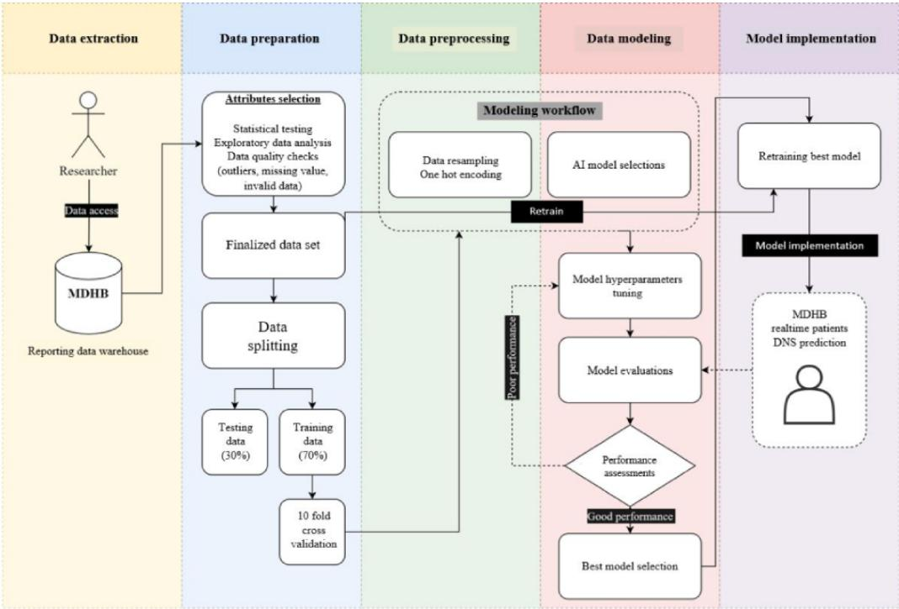
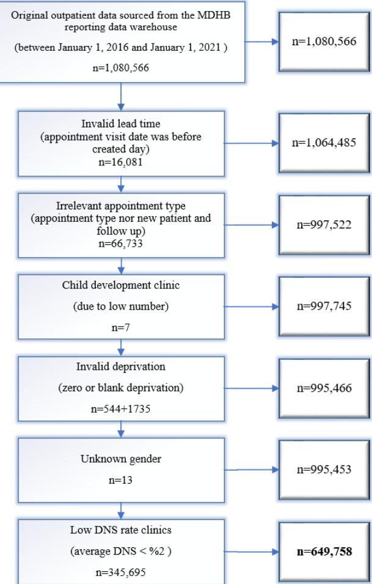
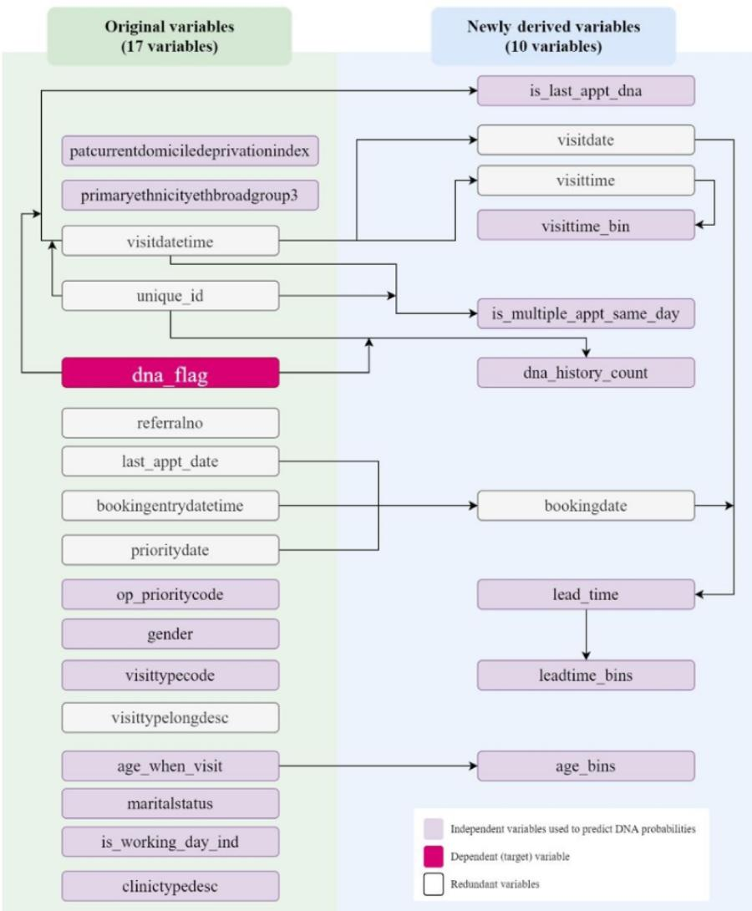
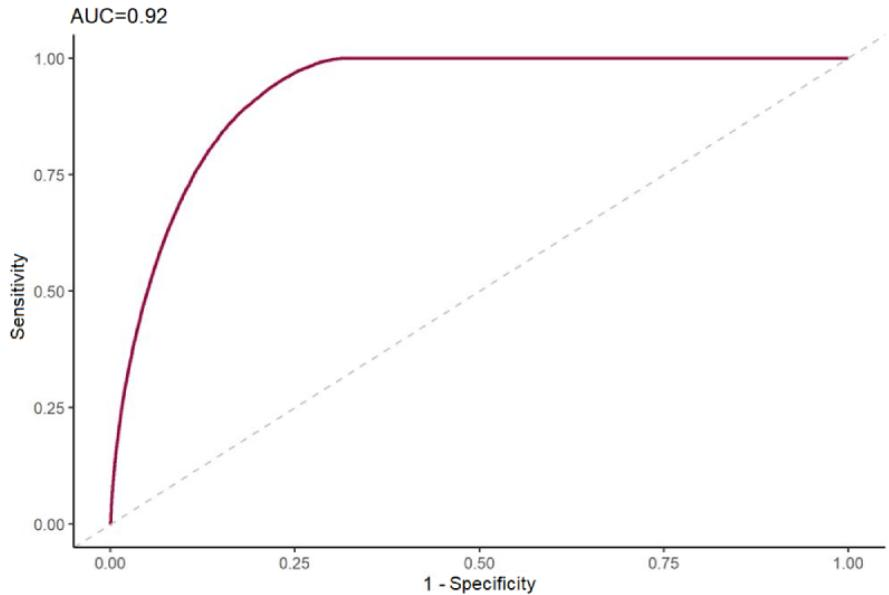

# Enhancing Health Equity by Predicting Missed Appointments in Health Care: Machine Learning Study

Yi Yang1, MSc; Samaneh Madanian1, PhD; David Parry2, PhD

1Auckland University of Technology, Auckland, New Zealand 2Murdoch University, Perth, Australia

Corresponding Author: Samaneh Madanian, PhD Auckland University of Technology 6 St Paul Street, AUT WZ Building Auckland, 1010 New Zealand Phone: 64 99219999 ext 6539 Email: sam.madanian@aut.ac.nz

## Abstract

Background: The phenomenon of patients missing booked appointments without canceling them—known as Did Not Show (DNS), Did Not Attend (DNA), or Failed To Attend (FTA)—has a detrimental effect on patients’ health and results in massiv health care resource wastage. Objective: Our objective was to develop machine learning (ML) models and evaluate their performance in predicting the likelihood of DNS for hospital outpatient appointments at the MidCentral District Health Board (MDHB) in New Zealand. Methods: We sourced 5 years of MDHB outpatient records (a total of 1,080,566 outpatient visits) to build the ML prediction models We developed 3 ML, models using logistic regression, random forest, and Extreme Gradient. Boosting (XGBoost) Subsequently, 10-fold cross-validation and hyperparameter tuning were deployed to minimize model bias and boost the algorithms prediction strength. All models were evaluated against accuracy, sensitivity, specificity, and area under the receiver operating characteristic (AUROC) curve metrics. Results:. Based on 5 vears of MDHB data, the best prediction classifier was XGBoost, with an area under the curve (AUC) of 0.92, sensitivity of 0.83, and specificity of 0.85. The patients’ DNS history, age, ethnicity, and appointment lead time significantly contributed to DNS prediction. An ML system trained on a large data set can produce useful levels of DNS prediction. Conclusions: This research is one of the very first published studies that use ML technologies to assist with DNS management in New Zealand. It is a proof of concept and could be used to benchmark DNS predictions for the MDHB and other district health boards. We encourage conducting additional qualitative research to investigate the root cause of DNS issues and potential solutions Addressing DNS using better strategies potentially can result in better utilization of health care resources and improve health equity.

(JMIR Med Inform 2024;12:e48273) doi: 10.2196/48273

## KEYWORDS

Did Not Show; Did Not Attend; machine learning; prediction; decision support system; health care operation; data analytics; patients no-show; predictive modeling; appointment nonadherence; health equity

## Introduction

Adding to the existing pressures on the health care system [1,2], further substantial disruptions are caused when patients fail to attend their prescheduled appointments [3]. This is defined as Did Not Show (DNS), which is a scheduled but not utilized clinical appointment that patients failed to attend without canceling or rescheduling. This phenomenon is also known as

Did Not Attend (DNA) or Failed To Attend (FTA). Causes include the patient forgetting about their appointment, miscommunication [4], logistical difficulties, appointment scheduling conflicts, and family/work commitments [3,5].

DNS can adversely affect patients’ well-being, cause them and the system financial stress, and disturb health care operations and systems. Globally, DNS has an overall rate of 23%, with a wide geographical variation (13.2% in Oceania, 19.3% in

Europe, 23.5% in North America, 27.8% in Asia, and 43% in South America [6]). DNS is expensive for health systems; for example, estimated annual losses amounting to £790 million (over US \$1 billion) were found in the United Kingdom [7] and \$564 million in the United States [8]. It affects both primary and secondary health care [9], although secondary care losses are higher.

Patients mostly fail to comply with their clinical appointments when symptoms become less severe or unnoticeable [10,11], which might deteriorate underlying syndromes [12,13]. Patients are more likely to demand immediate medical attention when contracting serious health issues or require acute and emergency care if they miss scheduled health care appointments [12,14-16].

Eliminating DNS is hard to achieve, and its adverse effects necessitate methods and approaches for managing DNS such as sending digital reminders by text, phone, and email [17,18]. These approaches have not been very effective, as they are time-consuming and costly, and the health care system still faces DNS issues. Overbooking [3,19], open access [20], and DNS penalty approaches have also been used to enhance clinical slot utilization but can cause longer waiting times for patients and overtime for clinical staff [21].

Inspired by the success of artificial intelligence (AI) in different sectors, including health care [22,23], we considered the application of AI for DNS management via predicting the probability of DNS appointments [13,19,24,25]. AI and its subset techniques, such as machine learning (ML), are powerful for extracting cognitive insights from massive amounts of data [26,27].

The predicted DNS probabilities proved to be successful in providing the required information for DNS management [25] and supporting health care managers in making informed decisions for prioritizing patients and delivering clinical assistance. This enables health care providers to reschedule and reuse limited clinical resources for urgent cases while also expanding access to health care services for patients from diverse backgrounds, thereby promoting health care equity.

Therefore, clinical capabilities and medical resources can be used more effectively and efficiently, decreasing patients’ wait times, increasing their satisfaction, and enhancing health productivity.

Most studies concerned with predicting DNS have mainly comprised small data sets or specific groups of people to develop models for DNS learning and prediction; however, DNS tends to be varied across populations. For example, longer distances to a medical facility increase DNS [8], but this finding was contradicted in another study [28]. Likewise, patients with chronic illnesses adhere to their scheduled appointments [13], while other studies [29] have shown that patients with more severe diseases have a higher DNS rate. Even within a single medical organization, DNS factors vary across different clinics [14]. These examples highlight the inconsistent nature of DNS predictors, showcasing the complexity of predicting tasks in this domain. Such variations pose challenges in creating a universal formula or model to effectively address DNS prediction issues on a global scale.

Considering the very limited DNS research in New Zealand and the complexity of developing a general DNS predictive model, we concentrated on the DNS issue in the MidCentral District Health Board (MDHB) hospital as a proof of concept. MDHB is located in the center of the North Island, New Zealand, covering a land area of over 8912 km2 and with a population of over 191,100 people. In this region, about 18% of people are aged 65 years or older, with over 20% being Māori, and a higher proportion than the national average resides in more deprived areas [30]. These demographic factors could lead to inequity in access to health care services. To support MDHB in addressing health equity and providing additional support for patients, this study aimed to develop ML models and compare their performance in predicting the probabilities of future DNS appointments at MDHB. This study utilized a data set spanning 5 years of collected data.

## Methods

## Overview

Our research was organized into the following phases (Figure 1). The initial phase involved data extraction, defining the data set to be used, and outlining the data extraction process. The data preparation phase involved conducting exploratory data analysis (EDA) to profile data and exclude irrelevant observations from the research. Subsequently, the data set was split into 2 parts—70% (454,831 records) for training and 30% (194,927 records) for testing. To avoid data linkage, the training and testing data sets were not mixed during the ML modeling phase. Moreover, the training set underwent a 10-fold cross-validation strategy to prevent bias as much as possible and fully utilize its limited training information. Next, the data preprocessing phase involved cleaning and transforming the cross-validation sets, ensuring that the training set was ready for the data modeling stage. A 10-fold cross-validation resampling strategy was applied to further optimize the utilization of the 70% training data. In the data modeling phase, we used 3 ML algorithms and tuned their hyperparameters to identify the best performance among the algorithms. Finally, in the model evaluation phase, various evaluation metrics were employed to determine the best-performing ML model for DNS prediction.

Figure 1. Research flow and procedure. AI: artificial intelligence; MDHB: MidCentral District Health Board.  

## Data Access and Extraction

Our data were sourced from MDHB reporting SQL farm and contained only outpatient visits with no link to other data sets. This significantly mitigated risks related to patient reidentification. Data deidentification and encryption were applied before data access, and New Zealand National Health Index numbers were encrypted to protect patients’ privacy. We acquired 1,080,566 outpatient visit records from 38 clinics between January 1, 2016, and December 31, 2020, satisfying the research requirements with almost 57,000 DNS incidents (5% of the entire data set). The steps of data exclusion are presented in Figure 2. Because not many missing records were identified in the data sets, those with missed values were directly excluded.

Figure 2. Research data exclusion. DNS: Did Not Show; MDHB: MidCentral District Health Board.  

## Ethical Considerations

This study received ethics approval from the Auckland University of Technology (AUT; 20/303) and MDHB (2020.008.003), following which data access to the MDHB reporting data warehouse was granted.

## Data Preparation

## Phase Description

In this phase, understanding the data was important to adequately prepare them for the experiments. The data preparation process included data transformation and derivation (Figure 3). Following suggestions from the literature, new research variables were derived and introduced because some valuable DNS predictors were absent in the MDHB data set. For example, no direct information was available on the patients DNS history [21,31], appointment lead time [31,32], or latest appointment DNS outcome [13]. The lead time was calculated by comparing the difference in days between the appointment creation date and the visit date. Appointments with longer lead times were expected to have greater DNA probability than those with shorter lead times [29].

Therefore, to better understand patient behavior and DNS patterns, we derived 10 new variables on top of the original variables (Figure 3). These attributes were introduced to support us in understanding when patients were more likely to miss their appointments in general and to identify regular nonadherent patients.

Initially, we extracted a data set with 17 columns and over 1 million records (Multimedia Appendix 1). Informed by the literature review [14,29,31-33], we derived and introduced another 10 variables on top of the original data and increased the data columns to 27. Among all the variables, 16 (59%) were used for ML modeling, and the redundant ones were excluded. The dna\_flag attribute was the dependent (target) variable. Figure 3 demonstrates the original variables in addition to 10 newly derived ones.

Figure 3. Variable transformation and derivation visualization.  

## Cardinality Reduction

We conducted a cardinality reduction analysis to reduce variable categories with low frequency and small samples. The data set mostly included categorical variables, with numeric variables being rare. Each categorical level is called a cardinality, which means how many distinct values are in a column. In our data set, some categorical variables had fewer levels, such as patient gender—M (male), F (female), and U (unknown)—while others had hundreds of variations, such as suburbs or diagnosis codes.

Developing ML models often involves numerous categorical attributes, necessitating examination of the variables’ cardinality, as most ML algorithms are distance-based and require converting categorical variables to numeric values. Categorical variables with high cardinality levels will derive massive new columns and expand the data set. This expansion increases model complexity, elevates computational costs, and decreases model generalization, which makes handling the data set challenging [34]. Therefore, we investigated the cardinality of our research variables and deployed a reduction strategy accordingly.

Cardinality reduction analysis was conducted to reduce the number of categories within variables with low frequency and small sample sizes. Following suggestions from the literature, new research variables were also derived and introduced, including patients’ prior DNS history [14,16,21] and the appointment lead time [14,16,29,32].

## Statistical Test

The chi-square test was used for analyzing homogeneity among different groups within variables [35] and for testing the independence between categorical variables [36]. The chi-square statistics $( \chi ^ { 2 } )$ and their P values were calculated to investigate whether different levels of a variable contributed differently to DNS events.

The confidence level (α=.05) was adopted as the P value threshold in the chi-square test. A P value less than .05 provided enough confidence to reject the null $( H _ { O } )$ hypothesis and accept the alternative hypothesis $( H _ { A } )$ . The tested categorical variable was associated with DNS events [36]. Hence, we may consider using it for future prediction.

After the data preparation process, 16 variables were selected to predict the target dna\_flag. Among them, 12 modeling predictors were nominal variables, including binary variables (Multimedia Appendix 2). We, therefore, conducted the chi-square $( \chi ^ { 2 } )$ statistical test to investigate the relationship between those predictors and DNS events (Table 1). The chi-square was calculated using the following equation, where O and E are observed and expected values [36,37]:

$$
\chi^ {2} = \sum_ {i = 1} ^ {n} \frac {(O _ {i} - E _ {i}) ^ {2}}{E _ {i}}
$$

After preparing the data set and before developing the ML models, an EDA was conducted to gain a deeper understanding of the research data landscape. EDA is a fundamental data analysis required before hypothesis and modeling formulation [38]. Its findings can be used to verify misleading models at a later stage [38] and reveal unexpected patterns [39]. The EDA helped uncover patients' DNS patterns through data aggregation and data visualization analysis. Finally, the EDA findings were validated against the ML model outcomes to verify their accuracy.

Table 1. Chi-square test on categorical variables.

<table><tr><td>Categorical variables</td><td>Chi-square statistic</td><td>Chi-square P value</td></tr><tr><td>dna_history_count</td><td>118,461</td><td>&lt;.01</td></tr><tr><td>is_last_appt_dna</td><td>77,600</td><td>&lt;.01</td></tr><tr><td>Clinictypedesc</td><td>35,201</td><td>&lt;.01</td></tr><tr><td>age_bins</td><td>34,810</td><td>&lt;.01</td></tr><tr><td>primaryethnicityethbroadgroup3</td><td>17,098</td><td>&lt;.01</td></tr><tr><td>leadtime_bins</td><td>11,048</td><td>&lt;.01</td></tr><tr><td>maritalstatus_group</td><td>10,527</td><td>&lt;.01</td></tr><tr><td>visit_type_group</td><td>3525</td><td>&lt;.01</td></tr><tr><td>visittime_bin</td><td>3447</td><td>&lt;.01</td></tr><tr><td>patcurrentdomiciledeprivationindex</td><td>2655</td><td>&lt;.01</td></tr><tr><td>is_multiple_appt_same_day</td><td>1913</td><td>&lt;.01</td></tr><tr><td>op_prioritycode_group</td><td>1,496</td><td>&lt;.01</td></tr><tr><td>is_working_day_ind</td><td>1,244</td><td>&lt;.01</td></tr><tr><td>Gender</td><td>4</td><td>.06</td></tr></table>

variables. For example, the variable gender derived 3 variables, gender\_male, gender\_female, and gender\_unknown. Each of those variables can have a value of either 1 or 0.

## Data Preprocessing

Due to the high number of categorical variables in our data set, the one-hot encoding technique was used in the preprocessing phase. Because distance-based algorithms can only deal with numerical values, in the cardinality reduction section, we used the one-hot encoding method to convert our categorical variables to numbers. After the conversion, different variables were introduced to our training data set, also known as indicator

As the predictive performance of classifiers is highly impacted by the selection of the hyperparameters [40], we conducted hyperparameter tuning to optimize our algorithms’ learning process. We further optimized this process using the Grid Search method to boost the performance of our chosen models. Table 2 outlines specific details regarding the hyperparameters utilized.

Table 2. Hyperparameter tuning of the data modeling.

<table><tr><td>Models and hyperparameters</td><td>R package</td><td>Range</td><td>Purpose</td></tr><tr><td colspan="4">Logistic regression</td></tr><tr><td>penalty</td><td>Glmnet</td><td>1e-10- 1</td><td>Total amount of regularization used to prevent overfit and underfit</td></tr><tr><td colspan="4">Random forest</td></tr><tr><td>Trees</td><td>Ranger</td><td>300- 1000</td><td>Number of trees in the forest</td></tr><tr><td>Min_n</td><td>Ranger</td><td>3-10</td><td>Minimum amount of data to further split a node</td></tr><tr><td>Mtry</td><td>Ranger</td><td>3-5</td><td>Maximum number of features that will be randomly sampled to split a node</td></tr><tr><td colspan="4"> $XGBoost^a$ </td></tr><tr><td>Trees</td><td>XGBoost</td><td>300-1000</td><td>Number of trees in the forest</td></tr><tr><td>Min_n</td><td>XGBoost</td><td>3-10</td><td>Minimum amount of data to further split a node</td></tr><tr><td>mtry</td><td>XGBoost</td><td>3-10</td><td>Maximum number of features that will be randomly sampled to split a node</td></tr><tr><td>tree_depth</td><td>XGBoost</td><td>3-12</td><td>Maximum depth of the tree</td></tr></table>

aXGBoost: Extreme Gradient Boosting.

## Data Modeling

Addressing the imbalanced data set posed the main data modeling challenge. The annual DNS rate for MDHB was around 5%, which means 95% of the appointments were attended visits. This imbalance significantly affected the accuracy of our ML model in predicting attended cases. To tackle this issue, various internal and external strategies exis [41,42]. In this study, we employed an external approach that involved utilizing standard algorithms intended for a balanced data set but applying resampling techniques to the trained data set to reduce the negative impact caused by the unequal class. Our focus was on the resampling strategy, known for its effectiveness in handling imbalanced classification issues and its portability [42].

The resampling strategy involved 2 methods: (1) oversampling, where the size of the minority class is increased randomly to approach the majority class in a class-imbalance data set [43,44]; and (2) undersampling, where the size of the majority class decreases randomly to align with the minority class [43,44]. This strategy falls under both the oversampling and undersampling categories. Given the lack of definitive guidance on the effectiveness of these methods [42-44], we adopted both and compared their results.

Since we dealt with a binary classification prediction problem, supervised and classification algorithms were selected. Algorithms with good interpretability were also considered to explain which predictive variables influence DNS prediction more significantly. In a study concerning variable importance, tree-based models, such as random forest (RF) and gradient-boosted decision trees, were shown to inherently possess features that measure variable importance [45].

For the imbalanced data set, we used ensembling methods due to their proven advantages [46,47]. The following algorithms were chosen for developing DNS prediction models: logistic regression (LR), RF, and Extreme Gradient Boosting (XGBoost).

LR was chosen because it is a suitable analysis method across multiple fields for managing binary classification [48]. Our research concerned a supervised classification problem to predict whether a future outpatient appointment will become a DNS visit. With the response variable (dna\_flag) offering dichotomous outcomes—either yes (1) or no (0)—LR stood as a fitting choice due to its proficiency in predicting binary outcomes and its established effectiveness in prior studies [7,13,33,49]. Tree-based ensembling algorithms were also chosen for their proven ability to deal with imbalanced data sets and model explainability [46,47]. RF can effectively handle combining random resampling strategies in imbalanced prediction. Tree-ensembling methods have more advanced prediction ability than a single model because they integrate prediction strength from several base learners [50].

## Model Implementation and Evaluation

We used 10-fold cross-validation for model selection and bias reduction. The hyperparameters were tuned to boost each classifier’s performance. We followed suggestions from the literature suggestions to use sensitivity, specificity, and the area under the receiver operating characteristic (AUROC) curve to quantify the models’ prediction strength for the imbalance problem prediction.

During this phase, we used the testing data to validate the best predictive model chosen based on the model evaluation criteria. For this study, data before 2021 were used in the data modeling process. We coordinated with MDHB to access outpatient appointments from 2021 for model validation. Specifically, we used both weekly and monthly data for prediction, comparing these with actual appointment outcomes to validate the model. The benefit of using a new data set for validation was to assess model bias and goodness of fit outside the research environment. Positive performance and high prediction accuracy would indicate potential real-life implementation of our research model after further investigation.

## Results

Our study only included new patients and follow-up appointments. Therefore, we analyzed DNS costs limited to new patient and follow-up outpatient services over the last 5 years. The MDHB provided us with costing information for 34 different departments, and we calculated the DNS cost for each department (Table 3). In 2020, there were 2812 new patient DNS visits and 6240 follow-up DNA visits causing a loss of at least \$2.9 million (US \$1.8 million) at MDHB. More information regarding this calculation is provided in Multimedia Appendix 3 [51].

Each department was assigned a corresponding outpatient appointment price for a new patient and follow-up outpatient appointment services. We aggregated the total DNS occurrences of new patients and follow-up appointments, multiplying corresponding unit prices to quantify their financial impact. For instance, in 2020, there were 301 new patients and 745 follow-up patients who missed their scheduled bookings, which caused a revenue loss of \$300,442 (US \$190,000) in the orthopedics department.

Although the initial research expected to address the DNS issue for all outpatient clinics and patients at the MDHB, due to the broad scope of the DNS, we concentrated on clinics with a higher percentage of DNS and narrowed down the research scope to prioritize workloads. To successfully build a model for our focused patient groups, we eliminated as many irrelevant data points as possible. Then, data used for the model training were more fit for purpose for the high-needs population.

The modeling data set was created using 649,758 records and 17 columns (Figures 1 and 3). We developed ML models based on LR, RF, and XGBoost algorithms, with hundreds of hyperparameter combinations in our data modeling. To evaluate the models’ prediction performance, accuracy, sensitivity, specificity, AUROC curves, and cost (computation time) were calculated (Table 4). The aim was to identify the best model and hyperparameters that resulted in optimal sensitivity and AUROC performances. Model prediction accuracy is critical; however, it was not a primary concern in this research as we dealt with an imbalanced data set [52].

Table 4 presents a summary comparison of the models performance. As shown in the table, the LR-based model was the fastest and RF the slowest in terms of computation time. LR had the lowest AUROC scores (ie, the low DNS events prediction accuracy), while RF and XGBoost had a similar area under the curve (AUC) performance (around 0.92).

The undersampling strategy significantly improved our models sensitivity. Sensitivity was chosen over accuracy because we were dealing with an imbalanced data set [52]. Sensitivity quantified the models’ ability to correctly predict positive (DNS) cases that help detect high-risk DNS patients. RF and XGBoost had a very close sensitivity of 0.82. However, considering the computation cost factor, XGBoost had the lowest modeling time. XGBoost with undersampling was our best ML model for the DNS prediction. Its ROC curve is illustrated in Figure 4.

A further investigation was also performed to identify the top predicting factors for each model (Multimedia Appendix 4). The purpose of calculating variable significance scores was not to plug them into a calculation formula but to showcase which variables were more relatively critical in calculating the risk of DNS. Variable importance is critical to AI model development, as variables do not contribute evenly to the final prediction. Therefore, we focused on the most influential predictors and excluded irrelevant ones by scoring the variables’ prediction contributions [53]. Variable importance is a measurement quantifying the relationship between an independent variable and the dependent [46].

The results shown in Multimedia Appendix 4 matched the chi-square statistical test results (Table 1). The leading factors were determined and selected using the variable (feature) importance. It was evident that the dna\_history\_count variable was the most influential predictor following is\_last\_appt\_dna, age\_when\_visit, and lead\_time. Additionally, ethnicity played an important role in constructing the XGBoost model for the DNS prediction.

We also aggregated outpatient appointment data and ranked the observed DNS rate of all outpatient clinics (Multimedia Appendix 5). We carried out this analysis to initiate an understanding of how disease type might influence the DNS rate.

Table 3. DNSa costs in 2020 at the MDHBb hospitalc.

| Clinics                           | $NP^d$ DNS count | NP DNS price | Total NP DNS cost  | FU e price| FU DNS cost | Total FU cost| Total DNS |
|-----------------------------------|-----------|--------|-----------|-----------------|--------|-----------|-----------|
| Orthopedics                       | 301       | \$346  | \$104,143 | 745             | \$263  | \$196,299 | \$300,442 |
| Diabetes                          | 90        | \$452  | \$40,658  | 576             | \$307  | \$176,643 | \$217,302 |
| Ophthalmology                     | 221       | \$239  | \$52,776  | 874             | \$174  | \$152,322 | \$205,099 |
| Pediatric medicine                | 124       | \$600  | \$74,366  | 327             | \$395  | \$129,271 | \$203,637 |
| Ear nose throat                   | 253       | \$358  | \$90,571  | 367             | \$269  | \$98,744  | \$189,316 |
| Gynecology                        | 177       | \$403  | \$71,322  | 386             | \$280  | \$108,124 | \$179,446 |
| Hematology                        | 75        | \$632  | \$47,389  | 232             | \$348  | \$80,834  | \$128,223 |
| Cardiology                        | 109       | \$490  | \$53,397  | 245             | \$299  | \$73,259  | \$126,656 |
| Radiation oncology                | 42        | \$505  | \$21,194  | 350             | \$293  | \$102,652 | \$123,846 |
| General surgery                   | 147       | \$387  | \$56,856  | 208             | \$309  | \$64,369  | \$121,225 |
| Audiology                         | 268       | \$214  | \$57,302  | 272             | \$214  | \$58,157  | \$115,459 |
| Neurology                         | 153       | \$617  | \$94,408  | 38              | \$400  | \$15,204  | \$109,612 |
| Gastroenterology                  | 68        | \$506  | \$34,393  | 186             | \$362  | \$67,401  | \$101,794 |
| Medical oncology                  | 18        | \$650  | \$11,703  | 229             | \$360  | \$82,327  | \$94,030  |
| Dental                            | 136       | \$244  | \$33,132  | 193             | \$244  | \$47,019  | \$80,151  |
| Renal medicine                    | 5         | \$559  | \$2,793   | 181             | \$344  | \$62,201  | \$64,995  |
| Respiratory lab                   | 38        | \$479  | \$18,192  | 121             | \$347  | \$42,021  | \$60,213  |
| Obstetrics                        | 101       | \$227  | \$22,906  | 143             | \$227  | \$32,431  | \$55,337  |
| Respiratory sleep                 | 20        | \$271  | \$5412    | 153             | \$271  | \$41,403  | \$46,815  |
| Urology                           | 65        | \$357  | \$23,178  | 85              | \$274  | \$23,253  | \$46,432  |
| Dietetics                         | 93        | \$175  | \$16,302  | 168             | \$175  | \$29,449  | \$45,751  |
| General medicine                  | 44        | \$517  | \$22,747  | 69              | \$322  | \$22,200  | \$44,948  |
| Respiratory                       | 39        | \$479  | \$18,671  | 70              | \$347  | \$24,309  | \$42,980  |
| Dermatology                       | 66        | \$316  | \$20,877  | 60              | \$236  | \$14,174  | \$35,051  |
| Oral and maxillofacial            | 23        | \$296  | \$6799    | 124             | \$203  | \$25,185  | \$31,984  |
| Endocrinology                     | 25        | \$525  | \$13,127  | 34              | \$332  | \$11,284  | \$24,411  |
| Rheumatology                      | 18        | \$647  | \$11,643  | 31              | \$345  | \$10,693  | \$22,336  |
| Plastic surgery (excluding burns) | 18        | \$296  | \$5321    | 69              | \$203  | \$14,014  | \$19,335  |
| GI f endoscopy         | 0         | \$506  | \$0       | 52              | \$362  | \$18,843  | \$18,843  |
| Community pediatrics              | 20        | \$600  | \$11,994  | 10              | \$395  | \$3953    | \$15,948  |
| Infectious diseases               | 7         | \$738  | \$5169    | 19              | \$534  | \$10,152  | \$15,321  |
| Neurosurgery                      | 1         | \$507  | \$507     | 29              | \$448  | \$12,990  | \$13,496  |
| Podiatry                          | 17        | \$207  | \$3522    | 47              | \$207  | \$9737    | \$13,259  |
| Aged ATR g health      | 18        | \$244  | \$4394    | 35              | \$244  | \$8545    | \$12,939  |
| Under 65 ATR                      | 3         | \$244  | \$732     | 5               | \$244  | \$1221    | \$1953    |
| Cardiothoracic                    | 0         | \$573  | \$0       | 4               | \$425  | \$1698    | \$1698    |
| Anesthetics                       | 9         | 0      | \$0       | 3               | \$0    | \$0       | \$0       |

aDNS: Did Not Show.  
bMDHB: MidCentral District Health Board.  
cA currency exchange rate of NZD \$1=US \$0.61 is applicable for the listed costs.

dNP: new patient.

eFU: follow-up.

fGI: gastrointestinal.

gATR: assessment, treatment, and rehabilitation.

Table 4. Comparison of the MLa models’ performance.

<table><tr><td>Classifier and resampling strategy</td><td>Sensitivity</td><td>Specificity</td><td> $AUC^b$ </td><td>Accuracy</td><td>Modeling cost</td></tr><tr><td colspan="6">Logistic regression</td></tr><tr><td>Undersampling (under_ratio=2)</td><td>0.5146</td><td>0.9227</td><td>0.8474</td><td>0.8897</td><td>Less than 1 hour (5 minutes)</td></tr><tr><td>Oversampling (over_ratio=0.5)</td><td>0.5091</td><td>0.9247</td><td>0.8592</td><td>0.8911</td><td>Less than 1 hour (14 minutes)</td></tr><tr><td colspan="6">Random forest</td></tr><tr><td>Undersampling (under_ratio=2)</td><td>0.8243</td><td>0.8524</td><td>0.9236</td><td>0.8501</td><td>Over 8 hours (8.4)</td></tr><tr><td>Oversampling (over_ratio=0.5)</td><td>0.5940</td><td>0.9260</td><td>0.9220</td><td>0.8990</td><td>Over 137 hours</td></tr><tr><td colspan="6"> $XGBoost^c$ </td></tr><tr><td>Undersampling (under_ratio=2)</td><td>0.8278</td><td>0.8490</td><td>0.9239</td><td>0.9117</td><td>Over 4 hours (4.8)</td></tr><tr><td>Oversampling (over_ratio=0.5)</td><td>0.8297</td><td>0.8549</td><td>0.9267</td><td>0.8529</td><td>Over 51 hours (51.83)</td></tr></table>

aML: machine learning.  
bAUC: area under the curve.  
cXGBoost: Extreme Gradient Boosting.

Figure 4. The receiver operating characteristic (ROC) of the best classifier, Extreme Gradient Boosting (XGBoost). AUC: area under curve.  

## Discussion

## Principal Findings

Our results are comparable to similar previously published analyses [9], although the AUC for XGBoost was slightly higher in our case. This may be due to the data selection and local characteristics. We initially built a generic DNS prediction model for all outpatient clinics at MDHB. However, in light of the literature and DNS complexity, the project scope was narrowed down to clinics with higher DNS rates. As discussed previously in this paper, we excluded irrelevant and missed data, invalid lead time appointments, and clinics with very low DNS rates. This approach improved the ML models' performance and made sense from an operational perspective. The developed models provided insights useful for understanding the contributing factors for DNS. We found that patient DNS history, appointment characteristics, work commitments, and socioeconomic status substantially contributed to DNS events.

## Patient DNS History

Understanding patients’ DNS history was crucial for predicting future DNS patterns (Table 5) and developing the ML models. This also aligned with the chi-square test results (Table 1), which ranked the dna\_history\_count and is\_last\_appt\_dna variables as the most important factors. Total DNS counts and the latest appointment’s DNS outcome are pivotal for calculating the probabilities of future DNS occurrences. These factors are consistent with the findings in the literature [14-16,21,32,54].

Managing DNS involves identifying patients with low adherence to scheduled visits for additional attention. Centralizing and managing DNS history can provide a comprehensive view, preventing data silos or gaps. Centralized monitoring can enhance the visibility of recurring DNS incidents and proactively alert clinicians of potential DNS cases. Our models account for changes in DNS behavior. To reduce the prediction bias, we screen for the most recent appointment DNS outcome (is\_last\_appt\_dna).

Table 5. Top prediction variables in the developed MLa models.

<table><tr><td>Algorithm and variable importance ranking</td><td>Undersampling model</td><td>Oversampling model</td></tr><tr><td colspan="3">Logistic regression</td></tr><tr><td>1</td><td>dna_history_count</td><td>dna_history_count</td></tr><tr><td>2</td><td>is_working_day</td><td>is_working_day</td></tr><tr><td>3</td><td>is_last_appt_dna</td><td>is_multiple_appt_same_day</td></tr><tr><td>4</td><td>is_multiple_appt_same_day</td><td>is_last_appt_dna</td></tr><tr><td>5</td><td>lead_time</td><td>lead_time</td></tr><tr><td colspan="3">Random forest</td></tr><tr><td>1</td><td>dna_history_count</td><td>dna_history_count</td></tr><tr><td>2</td><td>is_last_appt_dna</td><td>age_when_visit</td></tr><tr><td>3</td><td>lead_time</td><td>lead_time</td></tr><tr><td>4</td><td>age_bins</td><td>is_last_appt_dna</td></tr><tr><td>5</td><td>clinic_type_desc</td><td>clinic_type_desc</td></tr><tr><td colspan="3">XGBoost $^a$ </td></tr><tr><td>1</td><td>dna_history_count</td><td>dna_history_count</td></tr><tr><td>2</td><td>is_last_appt_dna</td><td>age_when_visit</td></tr><tr><td>3</td><td>age_when_visit</td><td>is_last_appt_dna</td></tr><tr><td>4</td><td>lead_time</td><td>ethnicity</td></tr><tr><td>5</td><td>Ethnicity</td><td>lead_time</td></tr></table>

aXGBoost: Extreme Gradient Boosting.

## Appointment Characteristics

Certain appointments expected more nonadherence, with distinct predictors related to appointment characteristics such as “working day” and “high lead time.” Longer lead times correlated with increased DNS probability, while appointments on working days were more prone to DNS than nonworking days. These findings align with reports from [33,54,55] and emphasize the significant impact of appointment lead time on DNS prediction, as also indicated in [8,14,16,32,33,54]. This underscores how appointment characteristics directly affect DNS outcomes immediately after scheduling. Therefore, incorporating ML-predicted DNS risk estimations during appointment scheduling could automatically flag higher DNS probability for proactive management.

Furthermore, our analysis of the op\_prioritycode variable (Multimedia Appendix 1) indicated that, in general, patients with more serious health conditions were more likely to attend their appointments. This observation is reflected in Multimedia

Appendix 5, which compares the DNS rates of different clinics with the overall average DNS rate of 0.053% (depicted red line). For example, patients visiting the audiology clinic had a potential DNS rate of 19.1% compared to a 0.9% DNS rate for the radiation oncology clinic. Our analysis of the op\_prioritycode variable was based on categorical data types reflecting appointment urgency and not based on a detailed analysis of each patient’s diagnosis.

## Work Commitments

Our findings suggest that patients struggled to adhere to appointments on working days or during working hours. Younger adults, particularly those between 20 and 30 years of age, had higher DNS rates due to work commitments, while older adults aged 65 years and above rarely missed their visits.

Furthermore, the XGBoost-based model highlighted that being single was an indicator of DNS visits (Figure 4). This could relate to time constraints among young professionals, a finding consistent with other studies [8,28,33,56]. For this group, a targeted reminder system could be developed to concentrate on appointments with higher DNA probability compared to the DNS risk threshold. Consequently, the population-based reminding system could help optimize resource allocation, including staff efforts and costs.

## Socioeconomic Status

We explored the deprivation index and clustered patient populations by using their ethnicity (Multimedia Appendix 6). Our findings indicated a strong association between European and Māori ethnicities and DNS outcomes, ranked among the top 5 predicting factors (Multimedia Appendix 4). Māori and Pacific populations had the highest DNS rates, in line with other research findings [56], while the European ethnicity had the lowest DNS rates. Māori and Pacific populations tended to reside in areas characterized by higher deprivation rates, whereas the percentage of other ethnicities living in higher deprivation regions decreased when the deprivation index increased.

In New Zealand, Māori and Pacific ethnical groups required increased health care attention [57] to ensure equity in the health care system. As indicated in Table 6, a larger proportion of these ethnic groups are situated in suburbs and areas with higher deprivation indexes (such as 8, 9, and 10) [58]. The higher deprivation index was also a strong indicator of socioeconomic deprivation geographically [58]. According to the New Zealand Index of Deprivation, neighborhoods with higher deprivation were more likely to experience adverse living conditions such as damp, cold, and crowded housing.

Moreover, regions with higher deprivation exhibit higher rates of unemployment, increased dependence on benefits, and more single-parent families [58]. Consequently, these living conditions and income disparities made patients living in these regions more susceptible to illness, while also encountering more barriers and obstacles in addressing their medical needs.

At MDHB, dedicated working groups were established to support Māori and Pacific patients in attending their scheduled hospital appointments. Our research reiterates the importance and necessity of those working groups, acknowledging the value of their work. Moreover, our model can support them further by providing tangible DNS probability scores to prioritize patients who require additional attention and support.

Table 6. Percentage of population residing at each deprivation level [58].

<table><tr><td>Deprivation level</td><td>Māori, n (%)</td><td>Pacific, n (%)</td><td>European, n (%)</td><td>Asian, n (%)</td><td>Other, n (%)</td></tr><tr><td>1</td><td>3113 (7)</td><td>293 (1)</td><td>37,314 (86)</td><td>2077 (5)</td><td>835 (2)</td></tr><tr><td>2</td><td>4951 (9)</td><td>429 (1)</td><td>46,405 (85)</td><td>1470 (3)</td><td>1071 (2)</td></tr><tr><td>3</td><td>6367 (13)</td><td>489 (1)</td><td>42,565 (84)</td><td>613 (1)</td><td>821 (2)</td></tr><tr><td>4</td><td>14,736 (14)</td><td>1747 (2)</td><td>84,728 (79)</td><td>4574 (4)</td><td>1593 (1)</td></tr><tr><td>5</td><td>14,400 (13)</td><td>3398 (3)</td><td>83,568 (77)</td><td>6015 (6)</td><td>1590 (1)</td></tr><tr><td>6</td><td>14,103 (15)</td><td>1759 (2)</td><td>74,351 (79)</td><td>2974 (3)</td><td>1248 (1)</td></tr><tr><td>7</td><td>13,442 (17)</td><td>3601 (5)</td><td>58,187 (75)</td><td>1858 (2)</td><td>870 (1)</td></tr><tr><td>8</td><td>36,843 (19)</td><td>5402 (3)</td><td>148,605 (75)</td><td>5434 (3)</td><td>1988 (1)</td></tr><tr><td>9</td><td>40,642 (24)</td><td>7324 (4)</td><td>111,319 (67)</td><td>5443 (3)</td><td>2442 (1)</td></tr><tr><td>10</td><td>31,998 (35)</td><td>6283 (7)</td><td>52,064 (56)</td><td>1610 (2)</td><td>521 (1)</td></tr></table>

## Operational and Managerial Implications

The total DNS loss incurred by the MDHB hospital was around \$2.9 million (US \$1.8 million) in 2020. Notably, we observed that clinics with less life-threatening diseases (diabetes, audiology, and dental) had higher DNS rates. Considering our use of MDHB data, we expect to identify similar patterns in other district health boards for which the same DNS predicting factors can be applied for DNS management.

While the primary objective of our research was to calculate DNS risk for promoting health equity, we believe that leveraging DNS prediction can aid in managing limited health care resources more efficiently. By quantifying the DNS probability for future appointments on a scale from 0.00 to 1, clinicians or hospital operation managers can develop more personalized health care services for their patients. This leads to enhancing equity in accessing health care services for a wider population.

The predictions derived can support MDHB managers in designing, planning, and implementing more informed DNS management strategies. For example, a DNS appointments threshold (eg, 0.7) can be set, and all appointments with predicted odds greater than 0.7 can be selected, releasing 70% of resources and allocating some (or all) to the remaining 30% of patients with a higher DNS risk. Potentially, these released resources can subsidize interventions to support attendance. Without DNS prediction, the hospital cannot decide where to focus on solving the DNS problem and must invest money uniformly for every patient, leading to equality rather than equity in health care service access. Equality is not fit for purpose, especially considering the high attendance rate of 95% over the past 5 years, indicating that most patients attend appointments without additional support. However, for more optimum use of health care resources, other policies and guidance for appointment scheduling should be considered [59].

## Potential Interventions to Reduce DNS

## DNS Suggests Life Hardships

When patients miss medical appointments, it is a critical indicator suggesting they may be experiencing hardships in their lives [15,54,60]. Considering that a higher DNS rate correlates with a higher deprivation index, we can assume that people residing in these areas may face greater transportation limitations. Moreover, people with severe mental health or addiction issues may not be able to independently visit their doctors [15]. These vulnerable groups require additional and ongoing appointment assistance. Unfortunately, they have been historically disadvantaged and marginalized by the current health care system [61].

The DNS prediction model we developed can help health care practitioners identify patients at higher risk of DNS. Targeted DNS improvement solutions can be designed based on predicted DNS probability, patient demography, and clinical history. This type of application can leverage the DNS prediction model to help identify and deliver patient-centric medical services to patients requiring additional help. Some examples are discussed in the subsequent sections.

## Expanding Integrated Health Care Networks

For patients not facing life-threatening illnesses or requiring long-term health management (such as patients with diabetes), expanding services closer to patients might help meet their needs. MDHB could consider deploying clinicians to outsourced sites to supervise practitioners or attend to patients directly. Moreover, increasing collaborations with primary health care networks, promoting nurse-led services, and contracting private specialists can also be viable options for decreasing DNS rates. Developing a one-stop medical hub with multidisciplinary clinics for patients with lower clinical risk could encourage attendance and reduce DNS visits [19]. This is consistent with the New Zealand Ministry's latest health care system reform strategies, which aim to uplift health care equity [61]. The reform emphasizes the establishment of more locality networks in the community, resonating well with our research findings.

## After-Hour Appointment Slots

To support young adults who are occupied by daily work, it might be favorable to increase more after-hour service slots in clinics when possible. If more appointment slots can be organized before or after working hours, working professionals may have more chances to adhere to their clinical appointments. Piloting more weekend clinics can also be a choice to meet younger generations’ needs. In consonance with our suggestion, the recent New Zealand health care reform also promoted more affordable after-hours services [61]. Additionally, offering transportation assistance and improved wraparound well-being support for patients with a high-risk score could increase attendance. At-home patient visits could also be offered and delivered to patients facing severe transport limitations.

## Limitations

Despite the success of our DNS prediction model, we need to acknowledge that it has some limitations. First, our model was trained on 5-year period data from MDHB. The single data source prevented us from exploring other critical dimensions such as household data or beneficiary data. We believe adding those data points would improve the prediction model and discover more patients’ DNS patterns.

Furthermore, we pairwise compared the attribute dna\_flag with other DNS predictor factors. However, future research should consider investigating and analyzing the association between variables and adding further variables to the conditioning set. This expanded analysis would offer deeper insights into patients DNS behaviors.

## Conclusions

To the best of our knowledge, this study represents one of the first attempts in New Zealand to develop ML prediction models supporting DNS management. We successfully developed and tested ML models to predict probabilities of outpatient appointments’ DNS. Our selected model had an AUROC of 0.92 and a sensitivity performance of 0.82.

## Acknowledgments

The authors would like to thank the New Zealand MidCentral District Health Board (MDHB) for their support of this study. We appreciate the advice, help, and support from the MDHB data analytics team, Dr Richard Fong, and Mr Rahul Alate. Without their contribution, this study would not have been possible.

## Conflicts of Interest

None declared.

## Multimedia Appendix 1

Details of variables and their definitions.

[DOCX File , 16 KB-Multimedia Appendix 1]

## Multimedia Appendix 2

Data type of original and newly derived variables. [DOCX File , 15 KB-Multimedia Appendix 2]

## Multimedia Appendix 3

Outpatient appointment prices. [DOCX File , 19 KB-Multimedia Appendix 3]

## Multimedia Appendix 4

Leading predicting factors of the best Extreme Gradient Boosting (XGBoost) model. [DOCX File , 212 KB-Multimedia Appendix 4]

## Multimedia Appendix 5

Did Not Show (DNS) rates of all outpatient clinics of the MidCentral District Health Board (MDHB) hospital. [DOCX File , 329 KB-Multimedia Appendix 5]

## Multimedia Appendix 6

Did Not Show (DNS) rates among different deprivation groups and ethnicities.

## References

1. Tun SYY, Madanian S, Mirza F. Internet of things (IoT) applications for elderly care: a reflective review. Aging Clin Exp Res. Apr 2021;33(4):855-867. [doi: 10.1007/s40520-020-01545-9] [Medline: 32277435]

2. Madanian S. The use of e-health technology in healthcare environment: The role of RFID technology. 10th International Conference on e-Commerce in Developing Countries: with focus on e-Tourism (ECDC); 15-16 April 2016; Isfahan, Iran IEEE; Presented at: 10th International Conference on e-Commerce in Developing Countries (ECDC); April 15-16, 2016;1-5; Isfahan, Iran. URL: https://ieeexplore.ieee.org/document/7492974 [doi: 10.1109/ECDC.2016.7492974]

3. Alaeddini A, Yang K, Reddy C, Yu S. A probabilistic model for predicting the probability of no-show in hospital appointments. Health Care Manag Sci. Jun 2011;14(2):146-157. [FREE Full text] [doi: 10.1007/s10729-011-9148-9] [Medline: 21286819]

4. Kaplan-Lewis E, Percac-Lima S. No-show to primary care appointments: why patients do not come. J Prim Care Community Health. Oct 2013;4(4):251-255. [doi: 10.1177/2150131913498513] [Medline: 24327664]

5. DeFife JA, Conklin CZ, Smith JM, Poole J. Psychotherapy appointment no-shows: rates and reasons. Psychotherapy (Chic). Sep 2010;47(3):413-417. [doi: 10.1037/a0021168] [Medline: 22402096]

6. Dantas L, Fleck J, Cyrino Oliveira FL, Hamacher S. No-shows in appointment scheduling - a systematic literature review. Health Policy. Apr 2018;122(4):412-421. [FREE Full text] [doi: 10.1016/j.healthpol.2018.02.002] [Medline: 29482948]

7. Blæhr E, Søgaard R, Kristensen T, Væggemose U. Observational study identifies non-attendance characteristics in two hospital outpatient clinics. Dan Med J. Oct 2016;63(10) [FREE Full text] [Medline: 27697132]

8. Davies ML, Goffman RM, May JH, Monte RJ, Rodriguez KL, Tjader YC, et al. Large-scale no-show patterns and distributions for clinic operational research. Healthcare (Basel). Mar 16, 2016;4(1) [FREE Full text] [doi: 10.3390/healthcare4010015] [Medline: 27417603]

9. Nelson A, Herron D, Rees G, Nachev P. Predicting scheduled hospital attendance with artificial intelligence. NPJ Digi Med. Apr 12, 2019;2(1):26. [FREE Full text] [doi: 10.1038/s41746-019-0103-3] [Medline: 31304373]

10. Samuels RC, Ward VL, Melvin P, Macht-Greenberg M, Wenren LM, Yi J, et al. Missed appointments: factors contributing to high no-show rates in an urban pediatrics primary care clinic. Clin Pediatr (Phila). Sep 12, 2015;54(10):976-982. [doi: 10.1177/0009922815570613] [Medline: 25676833]

11. Hayton C, Clark A, Olive S, Browne P, Galey P, Knights E, et al. Barriers to pulmonary rehabilitation: characteristics that predict patient attendance and adherence. Respir Med. Mar 2013;107(3):401-407. [FREE Full text] [doi: 10.1016/j.rmed.2012.11.016] [Medline: 23261311]

12. French LR, Turner KM, Morley H, Goldsworthy L, Sharp DJ, Hamilton-Shield J. Characteristics of children who do not attend their hospital appointments, and GPs' response: a mixed methods study in primary and secondary care. Br J Gen Pract. Jul 2017;67(660):e483-e489. [FREE Full text] [doi: 10.3399/bjgp17X691373] [Medline: 28630057]

13. Goffman RM, Harris SL, May JH, Milicevic AS, Monte RJ, Myaskovsky L, et al. Modeling patient no-show history and predicting future outpatient appointment behavior in the Veterans Health Administration. Mil Med. May 2017;182(5):e1708-e1714. [doi: 10.7205/MILMED-D-16-00345] [Medline: 29087915]

14. Mohammadi I, Wu H, Turkcan A, Toscos T, Doebbeling BN. Data analytics and modeling for appointment no-show in community health centers. J Prim Care Community Health. 2018;9:2150132718811692. [FREE Full text] [doi: 10.1177/21501327188116921[Medline: 30451063

15. Williamson AE, Ellis DA, Wilson P, McQueenie R, McConnachie A. Understanding repeated non-attendance in health services: a pilot analysis of administrative data and full study protocol for a national retrospective cohort. BMJ Open. Feb 14, 2017;7(2):e014120. [FREE Full text] [doi: 10.1136/bmjopen-2016-014120] [Medline: 28196951]

16. Lee G, Wang S, Dipuro F, Hou J, Grover P, Low L. Leveraging on predictive analytics to manage clinic no show and improve accessibility of care. IEEE; Presented at: IEEE International Conference on Data Science and Advanced Analytics (DSAA); October 19-21, 2017;19-21; Tokyo, Japan. URL: https://ieeexplore.ieee.org/document/8259804 [doi: 10.1109/DSAA.2017.25]

17. Orskov ER, Fraser C. The effects of processing of barley-based supplements on rumen pH, rate of digestion of voluntary intake of dried grass in sheep. Br J Nutr. Nov 1975;34(3):493-500. [doi: 10.1017/s0007114575000530] [Medline: 36]

18. Prasad S, Anand R. Use of mobile telephone short message service as a reminder: the effect on patient attendance. Int Dent J. Feb 18, 2012;62(1):21-26. [FREE Full text] [doi: 10.1111/j.1875-595X.2011.00081.x] [Medline: 22251033]

19. AlMuhaideb S, Alswailem O, Alsubaie N, Ferwana I, Alnajem A. Prediction of hospital no-show appointments through artificial intelligence algorithms. Ann Saudi Med. 2019;39(6):373-381. [FREE Full text] [doi: 10.5144/0256-4947.2019.373] [Medline: 31804138]

20. Kunjan K, Wu H, Toscos TR, Doebbeling BN. Large-scale data mining to optimize patient-centered scheduling at health centers. J Healthc Inform Res. Mar 4, 2019;3(1):1-18. [FREE Full text] [doi: 10.1007/s41666-018-0030-0] [Medline: 35415421]

21. Lenzi H, Ben AJ, Stein AT. Development and validation of a patient no-show predictive model at a primary care setting in Southern Brazil. PLoS One. Apr 4, 2019;14(4):e0214869. [FREE Full text] [doi: 10.1371/journal.pone.0214869] [Medline: 30947294]

22. Chen T, Madanian S, Airehrour D, Cherrington M. Machine learning methods for hospital readmission prediction: systematic analysis of literature. J Reliable Intell Environ. Jan 30, 2022;8(1):49-66. [doi: 10.1007/s40860-021-00165-y]

23. Madanian S, Parry D, Adeleye O, Poellabauer C, Mirza F, Mathew S, et al. Automatic speech emotion recognition using machine learning: digital transformation of mental health. Presented at: Pacific Asia Conference on Information Systems; July 5-9, 2022; Taipei, Taiwan and Sydney, Australia. URL: https://aisel.aisnet.org/pacis2022/45/

24. Kurasawa H, Hayashi K, Fujino A, Takasugi K, Haga T, Waki K, et al. Machine-learning-based prediction of a missed scheduled clinical appointment by patients with diabetes. J Diabetes Sci Technol. May 2016;10(3):730-736. [FREE Ful text] [doi: 10.1177/1932296815614866] [Medline: 26555782]

25. Barrera Ferro D, Brailsford S, Bravo C, Smith H. Improving healthcare access management by predicting patient no-show behaviour. Decision Support Systems. Nov 2020;138:113398. [FREE Full text] [doi: 10.1016/j.dss.2020.113398]

26. Madanian S, Rasoulipanah HR, Yu J. Stress detection on social network: public mental health surveillance. Presented at: The 2023 Australasian Computer Science Week; January 31-February 3, 2023;170-175; Melbourne, Australia. URL: https:/ /dl.acm.org/doi/10.1145/3579375.3579397 [doi: 10.1145/3579375.3579397]

27. Madanian S, Chen T, Adeleye O, Templeton J, Poellabauer C, Parry D, et al. Speech emotion recognition using machine learning — a systematic review. Intell Syst Appl. Nov 2023;20:200266. [FREE Full text] [doi: 10.1016/j.iswa.2023.200266]

28. Hamilton W, Round A, Sharp D. Patient, hospital, and general practitioner characteristics associated with non-attendance: a cohort study. Br J Gen Pract. Apr 2002;52(477):317-319. [FREE Full text] [Medline: 11942451]

29. Eid WE, Shehata SF, Cole DA, Doerman KL. Predictors of nonattendance at an endocrinology outpatient clinic. Endocr Pract. Aug 2016;22(8):983-989. [doi: 10.4158/EP161198.OR] [Medline: 27124692]

30. Living in MidCentral: geographic area and population. Te Whatu Ora Health New Zealand. Wellington, New Zealand. URL: https://www.careers.mdhb.health.nz/living-in-midcentral [accessed 2023-10-16]

31. Topuz K, Uner H, Oztekin A, Yildirim M. Predicting pediatric clinic no-shows: a decision analytic framework using elastic net and Bayesian belief network. Ann Oper Res. Apr 4, 2017;263(1-2):479-499. [doi: 10.1007/s10479-017-2489-0] [Medline: 44]

32. Lin Q, Betancourt B, Goldstein BA, Steorts RC. Prediction of appointment no-shows using electronic health records. J Appl Stat. Jul 2020;47(7):1220-1234. [FREE Full text] [doi: 10.1080/02664763.2019.1672631] [Medline: 35707022]

33. Fiorillo CE, Hughes AL, I-Chen C, Westgate PM, Gal TJ, Bush ML, et al. Factors associated with patient no-show rates in an academic otolaryngology practice. Laryngoscope. Mar 16, 2018;128(3):626-631. [FREE Full text] [doi: 10.1002/lary.26816] [Medline: 28815608]

34. García S, Luengo J, Herrera F. Data Preprocessing in Data Mining. Cham, Switzerland. Springer; 2015.

35. McHugh ML. The chi-square test of independence. Biochem Med (Zagreb). 2013;23(2):143-149. [FREE Full text] [doi: 10.11613/bm.2013.018] [Medline: 23894860]

36. Franke TM, Ho T, Christie CA. The chi-square test. Am J Eval. Nov 08, 2011;33(3):448-458. [doi: 10.1177/1098214011426594]

37. The R Project for Statistical Computing. The R Foundation URL: https://www.r-project.org/ [accessed 2023-10-15]

38. Behrens J, DiCerbo K, Yel N, Levy R. Exploratory data analysis. In: Handbook of Psychology: Research Methods in Psychology. New York, NY. John Wiley & Sons; 2012;2012.

39. Behrens JT. Principles and procedures of exploratory data analysis. Psychol Methods. Jun 1997;2(2):131-160. [doi: 10.1037/1082-989x.2.2.131]

40. Mantovani R, Horváth T, Cerri R, Vanschoren J. Hyper-parameter tuning of a decision tree induction algorithm. IEEE; Presented at: 5th Brazilian Conference on Intelligent Systems (BRACIS); October 9-12, 2016;37-42; Recife, Brazil. [doi: 10.1109/BRACIS.2016.018

41. Doucette J, Heywood M. GP classification under imbalanced data sets: active sub-sampling and AUC approximation. In: O’Neill M, Vanneschi L, Gustafson S, Alcázar A, Falco I, Cioppa A, et al, editors. Genetic Programming. Berlin, Germany Springer; 2008;9-23.

42. Estabrooks A, Jo T, Japkowicz N. A multiple resampling method for learning from imbalanced data sets. Comput Intell. Jan 28, 2004;20(1):18-36. [FREE Full text] [doi: 10.1111/j.0824-7935.2004.t01-1-00228.x]

43. Batuwita R, Palade V. Efficient resampling methods for training support vector machines with imbalanced datasets. IEEE; Presented at: 2010 International Joint Conference on Neural Networks (IJCNN); July 18-23, 2010;1-8; Barcelona, Spain. [doi: 10.1109/IJCNN.2010.5596787]

44. Xu-Ying Liu; Jianxin Wu; Zhi-Hua Zhou. Exploratory undersampling for class-imbalance learning. IEEE Trans Syst, Man, Cybern B. Apr 2009;39(2):539-550. [doi: 10.1109/tsmcb.2008.2007853]

45. Greenwell B, Boehmke B. Variable importance plots—An introduction to the vip package. R J. 2020;12(1):343. [doi: 10.32614/rj-2020-013]

46. Khalilia M, Chakraborty S, Popescu M. Predicting disease risks from highly imbalanced data using random forest. BMC Med Inform Decis Mak. Jul 29, 2011;11:51. [FREE Full text] [doi: 10.1186/1472-6947-11-51] [Medline: 21801360]

47. Chen C, Liaw A, Breiman L. Using random forest to learn imbalanced data. University of California Berkeley. 2004. URL: https://statistics.berkeley.edu/sites/default/files/tech-reports/666.pdf [accessed 2023-12-28]

48. Hosmer D, Lemeshow S, Sturdivant R. Applied Logistic Regression. Hoboken, NJ. John Wiley & Sons; 2013.

49. Devasahay SR, Karpagam S, Ma NL. Predicting appointment misses in hospitals using data analytics. Mhealth. 2017;3:12. [FREE Full text] [doi: 10.21037/mhealth.2017.03.03] [Medline: 28567409]

50. Sahin EK. Assessing the predictive capability of ensemble tree methods for landslide susceptibility mapping using XGBoost, gradient boosting machine, and random forest. SN Appl Sci. Jun 30, 2020;2(7) [doi: 10.1007/s42452-020-3060-1]

51. Nationwide service framework library online. Te Whatu Ora Health New Zealand. 2023. URL: https://www. tewhatuora.govt.nz/our-health-system/nationwide-service-framework-library/ [accessed 2023-10-14]

52. Nejatian S, Parvin H, Faraji E. Using sub-sampling and ensemble clustering techniques to improve performance of imbalanced classification. Neurocomputing. Feb 2018;276:55-66. [doi: 10.1016/j.neucom.2017.06.082]

53. Hastie T. The Elements of Statistical Learning: Data Mining, Inference, and Prediction. New York, NY. Springer; 2017.

54. Harvey HB, Liu C, Ai J, Jaworsky C, Guerrier CE, Flores E, et al. Predicting no-shows in radiology using regression modeling of data available in the electronic medical record. J Am Coll Radiol. Oct 2017;14(10):1303-1309. [doi: 10.1016/j.jacr.2017.05.007] [Medline: 28673777]

55. Ma N, Khataniar S, Wu D, Ng S. Predictive analytics for outpatient appointments. IEEE; Presented at: 2014 Internationa Conference on Information Science & Applications (ICISA); May 6-9, 2014;6-9; Seoul, South Korea. [doi: 10.1109/ICISA.2014.6847449]

56. Lamba M, Alamri Y, Garg P, Frampton C, Rowbotham D, Gearry R. Predictors of non-attendance at outpatient endoscopy: a five-year multi-centre observational study from New Zealand. N Z Med J. Jun 07, 2019;132(1496):31-38. [Medline: 31170131]

57. Maori health. New Zealand Ministry of Health. 2023. URL: https://www.health.govt.nz/our-work/populations/maori-health [accessed 2023-11-05]

58. Atkinson J. Socioeconomic deprivation indexes: NZDep and NZiDe. University of Otago. 2019. URL: https://www.otago.ac .nz/wellington/departments/publichealth/research/hirp/otago020194.html [accessed 2023-11-15]

59. Samorani M, LaGanga L. Outpatient appointment scheduling given individual day-dependent no-show predictions. Eur J Oper Res. Jan 2015;240(1):245-257. [FREE Full text] [doi: 10.1016/j.ejor.2014.06.034]

60. Wilcox A, Levi EE, Garrett JM. Predictors of non-attendance to the postpartum follow-up visit. Matern Child Health J. Nov 25, 2016:20(Suppl 1):22-27[doi: 10.1007/s10995-016-2184-91[Medline: 27562797

61. The new health system. New Zealand Department of the Prime Minister and Cabinet. 2021. URL: https://dpmc.govt.nz/ our-business-units/transition-unit/response-health-and-disability-system-review/information [accessed 2023-11-15]

## Abbreviations

AI: artificial intelligence

AUC: area under the curve

AUROC: area under the receiver operating characteristic

AUT: Auckland University of Technology

DNA: Did Not Attend

DNS: Did Not Show

EDA: exploratory data analysis

FTA: Failed To Attend

LR: logistic regression

MDHB: MidCentral District Health Board

ML: machine learning

RF: random forest

ROC: receiver operating characteristic

XGBoost: Extreme Gradient Boosting

Edited by C Lovis; submitted 17.04.23; peer-reviewed by A Blasiak, D Gartner; comments to author 02.10.23; revised version received 07.11.23; accepted 04.12.23; published 12.01.24

Please cite as:

Yang Y, Madanian S, Parry D

Enhancing Health Equity by Predicting Missed Appointments in Health Care: Machine Learning Study

JMIR Med Inform 2024;12:e48273

URL: https://medinform.jmir.org/2024/1/e48273

doi: 10.2196/48273

PMID: 38214974

©Yi Yang, Samaneh Madanian, David Parry. Originally published in JMIR Medical Informatics (https://medinform.jmir.org), 12.01.2024. This is an open-access article distributed under the terms of the Creative Commons Attribution License (https://creativecommons.org/licenses/by/4.0/), which permits unrestricted use, distribution, and reproduction in any medium, provided the original work, first published in JMIR Medical Informatics, is properly cited. The complete bibliographic information, a link to the original publication on https://medinform.jmir.org/, as well as this copyright and license information must be included.